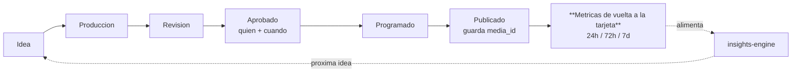

# Artefacto 2 — Flujo de trabajo ideal (operación continua)

## Diagrama Mermaid

```mermaid
flowchart TD
    subgraph EXT[Plataformas del cliente - OAuth por proyecto]
        IG[Instagram / Meta Ads]
        GG[GA4 / Google Ads / Business Profile / Search Console]
        TT[TikTok]
        DEL[Uber Eats / Rappi / DiDi]
        WA[WhatsApp Business]
    end

    subgraph BE[Backend - Supabase Edge Functions]
        CRON[Crons de sync<br/>cada 3-6h / diario]
        HOOK[Webhooks entrantes]
        ENG[insights-engine<br/>nightly + on-demand]
        CAOS[API CAOS extendida<br/>get-metrics / propose-action]
    end

    subgraph DB[(Supabase - RLS por proyecto)]
        MET[(metrics<br/>histórico append-only)]
        INS[(insights)]
        INT[(interactions)]
        PD[(project_data)]
    end

    subgraph APP[MKT.LANKA - vanilla JS]
        DASH[Dashboard auto]
        KAN[Kanban con métricas en tarjeta]
        DIR[Modo Director / Vista CEO]
        INBOX[Inbox unificado]
    end

    IG & GG & TT & DEL & WA --> CRON --> MET
    IG & GG --> HOOK --> MET
    MET --> ENG --> INS
    WA & IG & TT & GG --> HOOK --> INT
    MET & PD --> DASH & KAN & DIR
    INS --> DIR
    INT --> INBOX
    ENG -->|anomalia >20% / CPR alto / resena baja| ALERT{{Alerta}}
    ALERT -->|push + tarea CAOS| PAOLA[Paola / Loptus]
    CAOS <--> MET & INS
    PAOLA -->|aprueba| ACT[Pausar pauta / Publicar / Ajustar presupuesto]
    ACT --> EXT
```

## Flujo de contenido cerrado (el eslabón nuevo en negrita)



## Cadencia de sincronización

| Fuente | Frecuencia | Escribe a |
|---|---|---|
| Instagram orgánico | cada 6 h | metrics |
| Meta Ads (pauta) | cada 3 h | metrics |
| GA4 | diario | metrics |
| Google Business Profile (reseñas) | cada 6 h + webhook si disponible | metrics + interactions |
| Search Console | diario | metrics |
| TikTok | cada 6 h | metrics |
| Delivery (CSV/API) | semanal | metrics |
| WhatsApp / comentarios / DMs | webhook tiempo real | interactions |
| insights-engine | nightly + on-demand | insights |

## Decisión: IA sola vs. humano

| IA autónoma | IA propone → humano confirma |
|---|---|
| Ingesta y normalización de métricas | Pausar / escalar pauta |
| Marcar tarea CAOS al confirmar publicación | Aprobar / publicar contenido |
| Borrador "Qué funcionó / Qué cambiamos" | Cambiar ejes / presupuesto del trimestre |
| Sugerir mejor hora / formato | Responder reseña negativa / crisis |
| Alertar caídas > 20% | Reasignar presupuesto entre canales |
